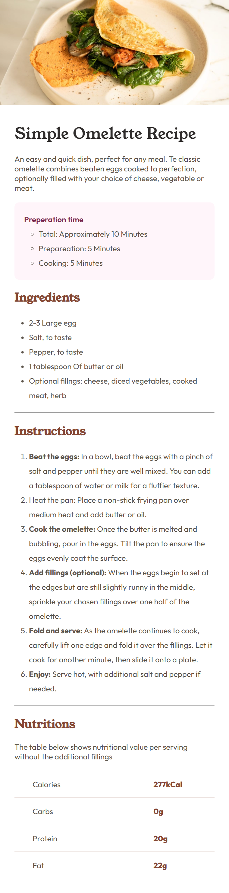
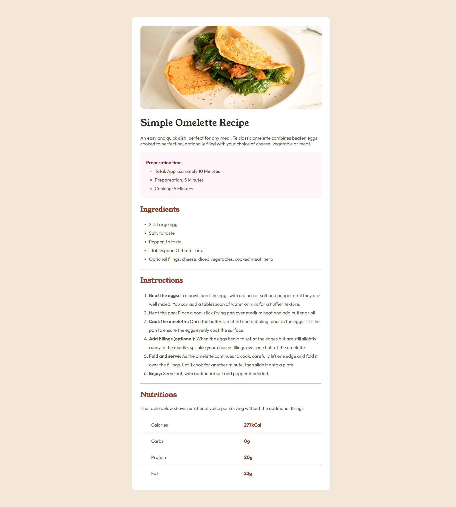

# Frontend Mentor - Recipe page solution

This is a solution to the [Recipe page challenge on Frontend Mentor](https://www.frontendmentor.io/challenges/recipe-page-KiTsR8QQKm). Frontend Mentor challenges help you improve your coding skills by building realistic projects. 

## Table of contents

- [Overview](#overview)
  - [The challenge](#the-challenge)
  - [Screenshot](#screenshot)
  - [Links](#links)
- [My process](#my-process)
  - [Built with](#built-with)
  - [What I learned](#what-i-learned)
  - [Continued development](#continued-development)
- [Author](#Author)  

## Overview
    A responsive recipe page website built with HTML, CSS and mobile first workflow. it works perfectly from desktop to mobile view

### Screenshot

### Links

- Solution URL: [Add solution URL here](https://your-solution-url.com)
- Live Site URL: [Add live site URL here](https://your-live-site-url.com)

## My process

### Built with

- Semantic HTML5 markup
- CSS custom properties
- Flexbox
- Mobile-first workflow

### What I learned

i learnt how to use first and last child to focus on a particular element, i also learnt how to properly use a mobile first workflow.

### Continued development

I would like to keep getting challenges like this to get better at every little part of building a website

## Author

- Frontend Mentor - [@Zimanie](https://www.frontendmentor.io/profile/Zimanie)
- Twitter - [@Zimanie5](https://www.twitter.com/Zimanie5)

